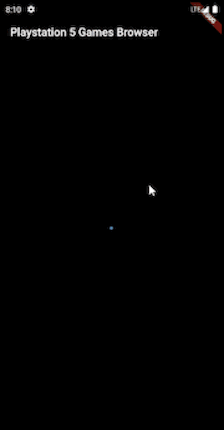

# Flutter Playstation 5 Game Browser




This project is a flutter app of playstation 5 game browser using [RAWG Video Games Database API](https://rawg.io/apidocs).

## Table of Contents
1. [Project Summary](#project-summary)
2. [Configure and Run Project](#configure-and-run-project)
3. [Project Architecture](#project-architecture)
4. [Application Features](#application-features)
5. [Code Coverage](#code-coverage)

## Project Summary
This Project is using several design patterns and libraries:
1. Version management: [Flutter Version Manager (FVM)](https://fvm.app/)
2. Modularization: [Melos](https://melos.invertase.dev/)
3. IDE: Android Studio
4. Project Architecture: Clean Architecture
5. State Management: [Bloc](https://pub.dev/packages/flutter_bloc)
6. Dependency Injection: [GetIt](https://pub.dev/packages/get_it), [Injectable](https://pub.dev/packages/injectable)
7. Navigation: [AutoRoute](https://pub.dev/packages/auto_route) 
8. Data Class Code Generator: [Freezed](https://pub.dev/packages/freezed), [JSON Serializable](https://pub.dev/packages/json_serializable)
9. Network: [Dio](https://pub.dev/packages/dio)
10. User Interface Widget: [Shimmer](https://pub.dev/packages/shimmer), [Infinite Scroll Pagination](https://pub.dev/packages/infinite_scroll_pagination)
11. Image Processing: [Cache Network Image](https://pub.dev/packages/cached_network_image)
12. Unit test: [Mocktail](https://pub.dev/packages/mocktail), [Http Mock Adapter](https://pub.dev/packages/http_mock_adapter), [Bloc Test](https://pub.dev/packages/bloc_test)
13. Widget test: [BDD Widget Test](https://pub.dev/packages/bdd_widget_test)

[back to top](#table-of-contents)

## Configure and Run Project
Application is tested and run in `Android` and `iPhone` devices.

To configure and run the project, you need to follow this step:
1. Install and configure [Flutter](https://docs.flutter.dev/get-started/install)
2. Install and configure version manager [Flutter Version Manager (FVM)](https://fvm.app/docs/getting_started/installation/)
```
dart pub global activate fvm
```
2. Install and configure workspace management: [Melos](https://melos.invertase.dev/getting-started)
```
dart pub global activate melos
```
3. Make sure all `PATH` has been configured. You can test it by run this in terminal
```
fvm --version
melos --version
```
4. Open `flutter_game_browser` in your IDE (Author use `Android Studio`)
5. Setup `flutter local sdk project` (Author use flutter version `3.7.3`)
```
fvm install
```
6. Setup all dependencies using `Melos`

This will run `flutter pub get` to all packages
```
melos bootstrap
```
7. Generate all code generator
```
melos generate
```
8. Connect devices or emulator
9. Run the app from IDE to Android or iPhone device

[back to top](#table-of-contents)

## Project Architecture


This project uses Clean Architecture for abstraction and separation of module.

By implementing this architecture, project will be clean, easy to read, scalable, maintainable, and testable module by module

This will also help project manager in team management to separate workload and team responsibility.

[back to top](#table-of-contents)

## Application Features
### Home Page
This is the app initial page
1. Get Playstation 5 game list and load more
 
   User can see the background image, game name, released date, and metacritic score

   

2. Pull to refresh

   User can pull to refresh the game list

   
   
### Game Detail Page
When user tap on game in home page, they will be redirected to game detail page.

User can see detail of the game (background image, game name, released date, metacritic, total ratings, genre, developer, and publisher)


[back to top](#table-of-contents)

## Code Coverage
Clean architecture with unit test and widget test allow Author to achieve `100%` code coverage


[back to top](#table-of-contents)
